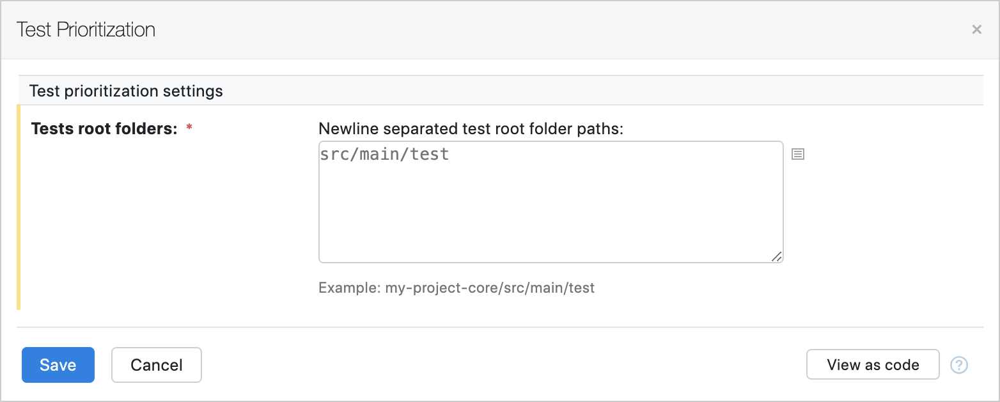

# Test Prioritization plugin for TeamCity

This plugin adds a Test Prioritization Build Feature to Teamcity.

This feature rearranges test entries such that tests with higher probability of failing will be executed earlier than
others. This reordering helps to receive testing feedback about failed tests sooner.

This feature currently supports only `Junit5` tests.

## Build

To build the plugin use:

```bash
mvn clean package
```

The generated zip file that can be found at `target/test-prioritization-plugin.zip`.

You can upload this file at the `Administration/Plugins` tab in a Teamcity server.

## Usage

Add the Test Prioritization Build Feature in your build configuration at the `Build Features` tab.
Next you need to specify your test root folder paths.



The config usually looks something like this:

```
api/src/main/test
core/src/main/test
runner/src/main/test
```

Click `Save` and you're all set.
